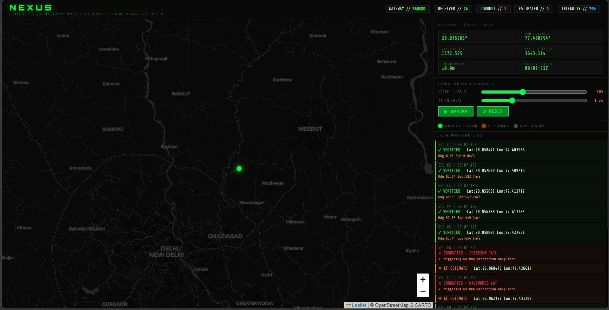

# PS2 — NEXUS: Predictive Reconstruction of Fragmented LoRa Telemetry
> Advanced Kalman filter-based reconstruction of corrupted LoRa telemetry for continuous IoT asset visibility

**CYBERJOAR AI Challenge | OC.41335.2026.59218**

NEXUS is an advanced LoRa telemetry reconstruction engine that demonstrates predictive state estimation for low-bitrate, high-latency IoT communications. When LoRa packets become corrupted due to interference, range limitations, or hardware faults, NEXUS employs a 4D Kalman Filter to maintain accurate asset tracking by predicting positions during data loss periods.

**Problem Statement PS2**: Develop a system that can reconstruct fragmented LoRa telemetry data using predictive algorithms, ensuring continuous asset visibility despite packet corruption in challenging RF environments.

## Key Features
- **Real-time Kalman Filtering**: 4D constant-velocity model for geospatial tracking with uncertainty quantification
- **Packet Integrity Validation**: Multi-layer checks including JSON syntax, field validation, coordinate bounds, and MD5 checksums
- **WebSocket Streaming**: Live packet processing and state updates to frontend dashboard
- **Corruption Simulation**: Realistic LoRa failure modes (missing fields, malformed data, checksum errors, truncated packets)
- **Interactive Dashboard**: Leaflet-powered map visualization with real-time position markers and trail history
- **Historical Buffer**: Pattern-of-life analysis with rolling 60-packet buffer for velocity smoothing
- **Dual Operation Modes**: Standalone frontend demo or full-stack Python backend simulation

## Stack
| Layer | Technology |
|-------|-----------|
| Frontend | HTML5 / CSS3 / Vanilla JS / Leaflet.js |
| Backend | Python 3.12 / Flask / Flask-SocketIO |
| Algorithm | 4D Kalman Filter (constant-velocity motion model) |
| Transport | WebSocket — real-time packet streaming |

## Folder Structure
```
PS2_NEXUS/
├── index.html        ← Frontend dashboard (open in browser)
├── lora_engine.py    ← Flask + Kalman Filter backend
├── requirements.txt  ← Python dependencies
├── README.md         ← This documentation
└── screenshot/
    └── nexus_dashboard.png  ← Dashboard screenshot
```

## How to Run

### Frontend only (demo mode)
Just open `index.html` in any browser — no setup needed.
Press START to simulate live LoRa packets with built-in JS Kalman filter.

### Full stack (Frontend + Python backend)
```bash
# 1. Install dependencies
pip install -r requirements.txt

# 2. Start the engine
python lora_engine.py
# → Running on http://localhost:5002 (WebSocket enabled)

# 3. Open index.html in browser
```

## WebSocket Events
| Event | Direction | Description |
|-------|-----------|-------------|
| `start_sim` | Client → Server | Start simulation with `loss_rate`, `tx_interval` |
| `stop_sim` | Client → Server | Pause the simulation |
| `reset_sim` | Client → Server | Reset all state and Kalman filter |
| `update_params` | Client → Server | Live-update loss rate / interval |
| `packet` | Server → Client | Emits each packet result (verified / corrupted / estimated) |
| `sim_status` | Server → Client | Running state confirmation |

## REST Endpoints
| Method | Endpoint | Description |
| Layer | Technology |
|-------|-----------|
| Frontend | HTML5 / CSS3 / Vanilla JS / Leaflet.js |
| Backend | Python 3.12 / Flask / Flask-SocketIO |
| Algorithm | 4D Kalman Filter (constant-velocity motion model) |
| Transport | WebSocket — real-time packet streaming |

## Folder Structure
```
PS2_NEXUS/
├── index.html        ← Frontend dashboard (open in browser)
├── lora_engine.py    ← Flask + Kalman Filter backend
├── requirements.txt  ← Python dependencies
└── README.md
```

## How to Run

### Frontend only (demo mode)
Just open `index.html` in any browser — no setup needed.
Press START to simulate live LoRa packets with built-in JS Kalman filter.

### Full stack (Frontend + Python backend)
```bash
# 1. Install dependencies
pip install -r requirements.txt

# 2. Start the engine
python lora_engine.py
# → Running on http://localhost:5002 (WebSocket enabled)

# 3. Open index.html in browser
```

## WebSocket Events
| Event | Direction | Description |
|-------|-----------|-------------|
| `start_sim` | Client → Server | Start simulation with `loss_rate`, `tx_interval` |
| `stop_sim` | Client → Server | Pause the simulation |
| `reset_sim` | Client → Server | Reset all state and Kalman filter |
| `update_params` | Client → Server | Live-update loss rate / interval |
| `packet` | Server → Client | Emits each packet result (verified / corrupted / estimated) |
| `sim_status` | Server → Client | Running state confirmation |

## REST Endpoints
| Method | Endpoint | Description |
|--------|----------|-------------|
| GET | `/api/health` | Service health check |
| GET | `/api/history` | Last 60 verified positions (pattern-of-life buffer) |
| GET | `/api/kalman/state` | Current Kalman filter state snapshot |

## Kalman Filter — Math
```
State vector:   x = [lat, lon, v_lat, v_lon]

Transition:     x̂ = F·x          (constant velocity model)
Covariance:     P = F·P·Fᵀ + Q
Innovation:     y = z − H·x̂
Kalman gain:    K = P·Hᵀ·(H·P·Hᵀ + R)⁻¹
State update:   x = x̂ + K·y
Cov update:     P = (I − K·H)·P
```

**When packet is CORRUPT** → `predict()` only (no measurement update)  
**When packet is VALID** → `predict()` + `update()` with real GPS coords

## Simulation Details

The system simulates a LoRa-enabled asset following a predefined circular route around the Delhi region. The route consists of 10 waypoints forming a loop approximately 25km in circumference.

**Route Waypoints:**
- Start: (28.85°N, 77.40°E) - South Delhi
- Via: Gurgaon, Faridabad, Ghaziabad, Noida
- Return to start

**Packet Generation:**
- **Interval**: Configurable 0.5-3.0 seconds (default 1.2s)
- **GPS Noise**: ±130m standard deviation (realistic LoRa accuracy)
- **Corruption Rate**: Adjustable 5-70% (default 30%)
- **Packet Format**: JSON with seq, timestamp, lat/lon, altitude, HDOP, satellites, checksum

**Kalman Filter Parameters:**
- **State Vector**: [latitude, longitude, velocity_lat, velocity_lon]
- **Process Noise**: Models unpredictable path changes
- **Measurement Noise**: GPS accuracy (~5m RMS)
- **Prediction**: Constant-velocity motion model
- **Update**: Only on valid packets, prediction-only during corruption

## Architecture
```
LoRa Gateway (simulated asset moving along route)
        │  raw JSON strings (some corrupted)
        ▼
PacketIntegrityChecker
  ├── JSON syntax validation
  ├── Required field check
  ├── Coordinate range check
  └── MD5 checksum verification
        │
        ├── VALID   → KalmanFilter.predict() + KalmanFilter.update()
        └── CORRUPT → KalmanFilter.predict() only
        │
        ▼
Flask-SocketIO  →  WebSocket  →  Frontend
  Green dot = verified        Amber dot = KF estimated
```

## Screenshots

### Dashboard Overview


The main dashboard displays real-time LoRa telemetry reconstruction. The map shows the asset's position with green dots for verified GPS positions and amber dots for Kalman-filtered estimates during packet corruption. The control panel allows adjusting packet loss rates and transmission intervals to simulate various LoRa conditions.

Key elements include:
- **Real-time Map**: Leaflet-powered visualization centered on Delhi region with asset trail
- **Kalman State Display**: Live filter parameters including position estimates, velocities, and uncertainty
- **Packet Statistics**: Counters for received, corrupted, and estimated packets with integrity percentage
- **Live Log**: Streaming packet validation results with corruption details and filter actions
